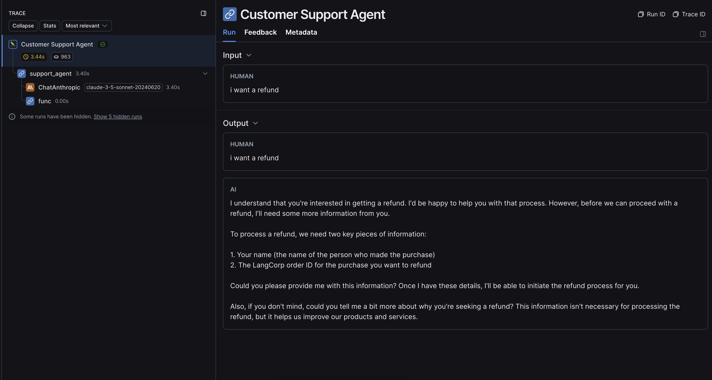
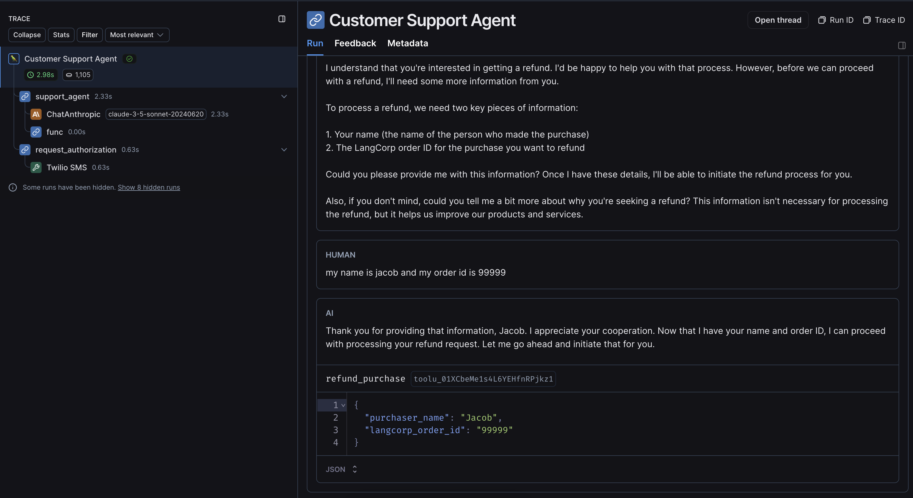
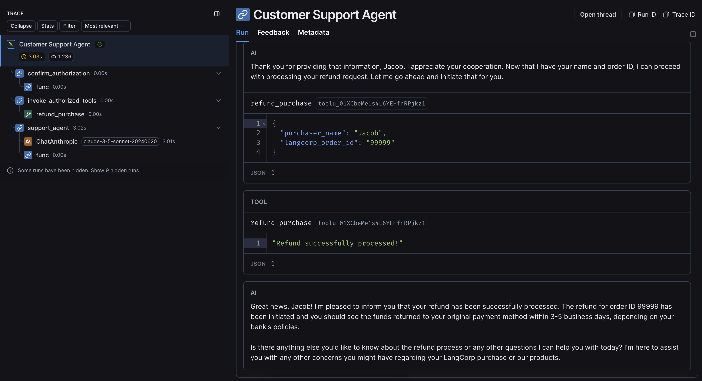

# Agent with two-factor authorization

This repo implements an agent, modeled after a customer support rep, with two sets of tools:

- Readonly tools that can be called freely
- A more sensitive `refund` tool that requires authorization

If you ask conversational questions like `"How are you today?"` the agent will answer without calling other tools.
If you ask the agent technical questions or billing questions, it will attempt to gather
enough information to call an appropriate tool (mocked out in `src/lib/tools.ts`).

And finally, if you query the agent with a refund related question, it will generate a four digit test code,
then text it to a phone number using [Twilio](https://twilio.com/). The agent will then pause execution,
and will only resume after you send the code back. If you enter the wrong code, it will generate a new code and resend it,
but if you generate the correct one, it will treat you as authorized and invoke the refund tool!


## Stack

- [Twilio](https://twilio.com) for sending SMS messages
- [Anthropic](https://anthropic.com) for the chat model
- [LangGraph.js](https://langchain-ai.github.io/langgraphjs/) to implement and orchestrate the agent
- [Cloudflare D1](https://developers.cloudflare.com/d1/) for checkpointing and state
- [Cloudflare Workers](https://developers.cloudflare.com/workers/) for development and hosting
- [LangSmith](https://docs.smith.langchain.com/) for tracing and development (optional)

## Setup

### Cloudflare

After cloning this repo, you will need to set up Cloudflare's [Wrangler CLI](https://developers.cloudflare.com/workers/get-started/guide/). You will also need to create a [D1 instance](https://developers.cloudflare.com/d1/) and add it to the `wrangler.toml` file:

```toml
[[d1_databases]]
binding = "DB" # i.e. available in your Worker on env.DB
database_name = "<YOUR DATABASE NAME>"
database_id = "<YOUR DATABASE ID>"
```

### Twilio

Sign up for [Twilio](https://twilio.com) and claim a phone number. You'll then need to set the following secrets in `.dev.vars`:

```bash
TWILIO_ACCOUNT_SID="<YOUR SID>"
TWILIO_AUTH_TOKEN="<YOUR AUTH TOKEN>"
TWILIO_PHONE_NUMBER="<YOUR CLAIMED PHONE NUMBER>"
TWILIO_DESTINATION_PHONE_NUMBER="<YOUR PERSONAL PHONE NUMBER>"
```

Don't forget to add a `+` character in front of the phone numbers.

### Anthropic

Sign up for an [Anthropic account](https://anthropic.com) and set your API key as a secret in `.dev.vars`:

```bash
ANTHROPIC_API_KEY="<YOUR API KEY>"
```

### LangSmith (tracing)

If you would like to use [LangSmith](https://docs.smith.langchain.com/) for tracing as you continue to test and extend this app, you'll need to set the following secrets in `.dev.vars`:

```bash
LANGCHAIN_TRACING_V2="true"
LANGCHAIN_API_KEY="<YOUR API KEY>"
```

## Usage

Install dependencies with `npm install`, then run `npm run dev` to spin up a local instance.

There is currently no frontend, but you can ping the endpoint directly with a `GET` request with query parameters:

`http://localhost:8787/?thread_id=<SOME THREAD ID>&question=I%20want%20a%20refund!`

You would then see a run [like this](https://smith.langchain.com/public/e7065249-7e66-4993-b66f-593115634477/r) asking for more information, since the refund tool requires a name and an order number:



You can continue the conversation by passing the same thread id with a new question.

`http://localhost:8787/?thread_id=54321&question=my%20name%20is%20jacob%20and%20my%20order%20id%20is%2099999`

If you followed up with the requested information, you would see a run [like this](https://smith.langchain.com/public/d482a470-d989-4f50-b240-f4888b58f330/r) where the model requires authorization before calling the refund tool:



For the confirmation step, you'll need to add an additional query param:

`http://localhost:8787/?thread_id=<SOME THREAD ID>&two_factor_code=<TEXTED CODE>`

And if the code is correct, the agent will successfully authorize and call the refund tool, resulting in a run [like this](https://smith.langchain.com/public/fed51729-1c37-406d-9d2d-dedc97ad876f/r):



If you enter the wrong code, you'll be texted again.

If you pass `question` and `two_factor_code` at the same time, the question will be ignored.

## Thank you!

This repo is meant as a starting point and a showcase of what is possible with LangGraph's human-in-the-loop features.
You could extend it with other tools, models, or flows.

For more, follow me on X [@Hacubu](https://x.com/hacubu)!
